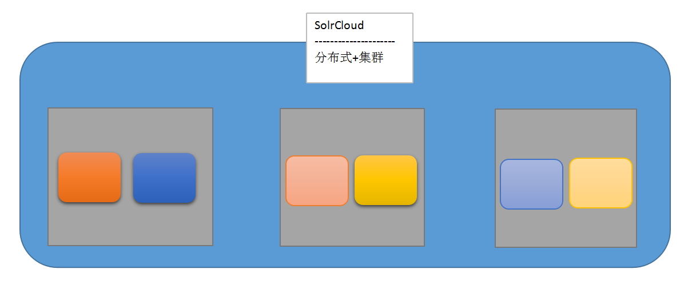

# 1. 集群和分布式的区别

### 集群:各节点执行相同的任务

​	负载均衡

​	错误恢复

### 分布式:各节点执行的任务不同

通常的软件部署都是集群+分布式

# 2. 搭建Zookeeper集群

### 选举原则

	1. 谁大就选谁
	2. 超过半数认同
	3. 领导不会退位

### 异常测试

* 从服务器挂掉,集群正常
* 主服务器挂掉,集群正常,其他节点重新进行选举
* 集群中只剩一个节点,集群异常

# 3. 搭建Solr集群

### SolrCloud的特点:

1. 查询时自动负载均衡
2. 集中式的配置信息
3. 自动容错
4. 近实时搜索

 

### Zookeeper的关系

Zookeeper确定集群中节点的主从关系,solr提供数据查询

# 4. 搭建Redis集群

